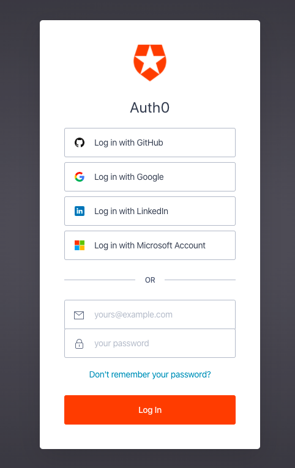

# Initial page

## Setting Up Auth0 Templates

1. Login to Auth0



1. Enter the following text

Bego Test 😆 


```css
.auth0-header {
    font-size: 24px;
}
```


 Do not paste anything over the existing auth0 content.


Once you're strong enough, save the world: 

sdfsdfs hihsdf kjhads fkla



```bash
# Ain't no code for that yet, sorry
echo 'You got to trust me on this, I saved the world'
```


| Key | Value |
| :--- | :--- |
| `{{default}}` | "hello" |


